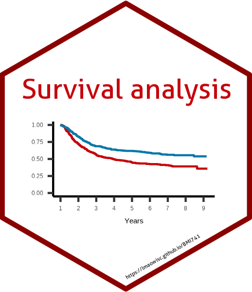
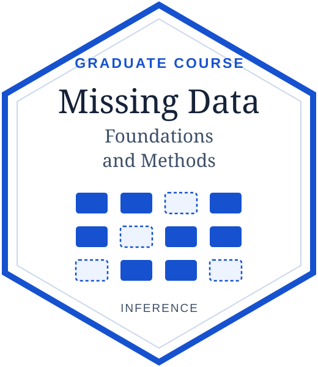

## University Courses

### [Applied Survival Analysis](https://lmaowisc.github.io/BMI741/) {#applied-survival-analysis}
:::: {.course-entry}
::: {.course-avatar}
{.course-image-link}\
[Spring 2020 -- 2025]{.course-date}
:::

::: {.course-outline}
Provides a survey of statistical methods for time-to-event data arising in medical and industrial settings.

-   Kaplan-Meier estimator, log-rank test, Cox proportional hazards model
-   Multiple failures, recurrent events, competing risks, joint analysis with longitudinal data, multistate processes, composite endpoints
-   Causal inference, machine learning

Emphasizes case studies and data analysis (using R)
:::
::::

### [Applied Longitudinal Analysis](https://lmaowisc.github.io/longitudinal-analysis/) {#applied-longitudinal-analysis}
:::: {.course-entry}
::: {.course-avatar}
{.course-image-link}\
[Spring 2019]{.course-date}
:::

::: {.course-outline}
Introduces statistical methods for repeated measurements and correlated outcomes, with applications in the health and behavioral sciences.

-   Response profiles, mean and covariance structures
-   Linear mixed-effects models and growth curves
-   Marginal models, generalized estimating equations (GEE), and generalized linear mixed-effects models
-   Missing data, smoothing, and multilevel models

Includes 24 lectures, SAS examples, and datasets for practice
:::
::::

### [Missing Data: Theory and Methods](https://lmaowisc.github.io/missing_data/) {#missing-data}
:::: {.course-entry}
::: {.course-avatar}
{.course-image-link}\
[2017]{.course-date}
:::

::: {.course-outline}
Develops statistical inference for incomplete data, connecting likelihood-based and semiparametric methods.

-   Missingness mechanisms and identifiability
-   EM algorithms, regression with missing covariates, and multiple imputation
-   Bayesian analysis, inverse probability weighting, and doubly robust estimation

Includes seven chapters and lecture slides
:::
::::

## Workshops

### [Tidy Survival Analysis: Applying R's Tidyverse to Survival Data](https://lmaowisc.github.io/tidysurv/) {#tidy-survival-analysis}
:::: {.course-entry}
::: {.course-avatar}
{.course-image-link}\
[JSM 2025]{.course-date}
:::

::: {.course-outline}
Applies tidy R workflows to survival analysis.

-   Data preparation, visualization, and summary tables
-   Survival and competing-risk analysis; Cox regression and diagnostics
-   Machine learning for survival outcomes with `tidymodels`
:::
::::

### [Statistical Methods for Composite Endpoints: Win Ratio and Beyond](https://lmaowisc.github.io/ce/) {#composite-endpoints}
:::: {.course-entry}
::: {.course-avatar}
{.course-image-link}\
[NESS 2025]{.course-date}
:::

::: {.course-outline}
Focuses on statistical methods for composite endpoints in clinical trials.

-   Win ratio testing and sample size calculation
-   Restricted win ratio, average win time, and while-alive loss rate
-   Proportional win-fractions regression and risk prediction
:::
::::
