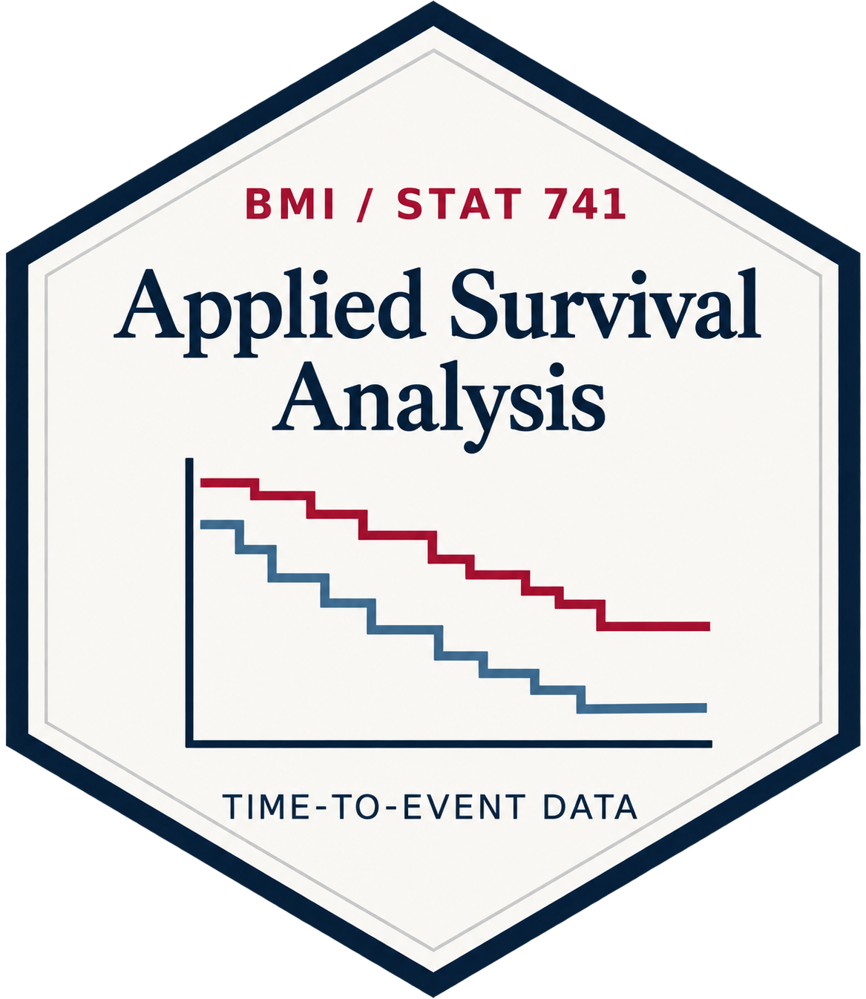
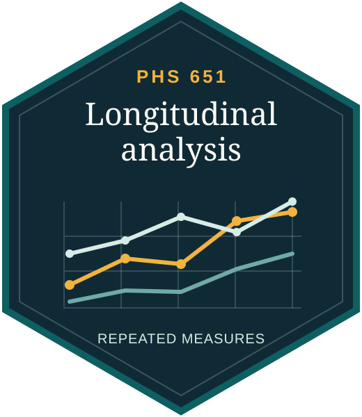
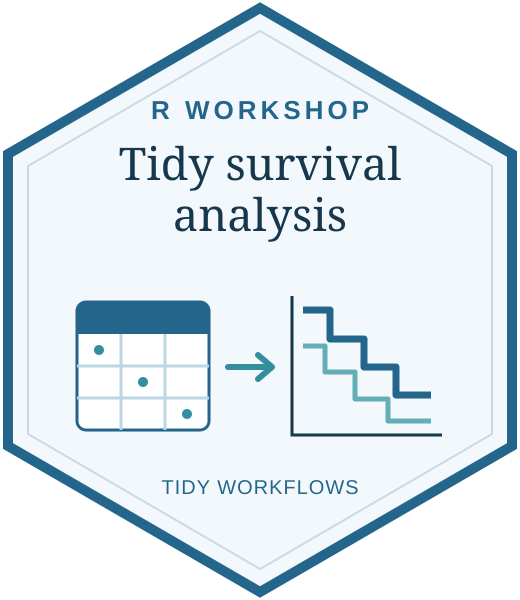
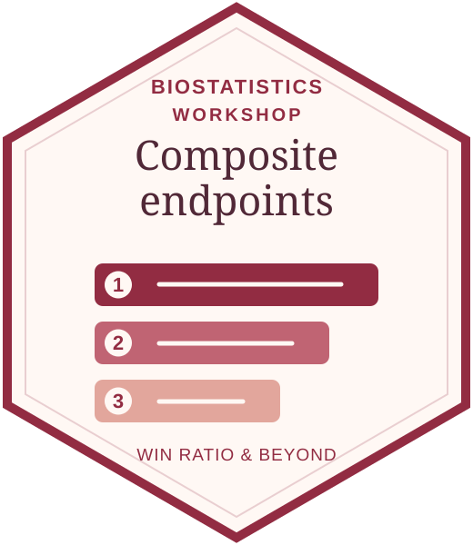

```{=html}
<div class="courses-page">
<p class="course-intro">University teaching and conference workshops in biostatistical methods, practice, and computing</p><section class="course-section" aria-labelledby="university-teaching"><span id="university-courses" class="course-anchor" aria-hidden="true"></span><h2 id="university-teaching">University Teaching</h2>
<article class="course-entry" aria-labelledby="applied-survival-analysis">
      <a class="course-badge-link" href="https://lmaowisc.github.io/BMI741/" target="_blank" rel="noopener noreferrer">
        
      </a>
      <div class="course-copy">
        <h3 id="applied-survival-analysis"><a href="https://lmaowisc.github.io/BMI741/" target="_blank" rel="noopener noreferrer">Applied Survival Analysis</a></h3>

        <p class="course-meta">Spring 2020–2025  ·  R examples and case studies</p>
        <p class="course-description">Methods for time-to-event data, with case studies and hands-on analysis in R.</p>
        <ul class="course-topics"><li>Kaplan–Meier estimation, log-rank tests and Cox regression</li><li>Recurrent events, competing risks, joint models and multistate processes</li><li>Composite endpoints, causal inference and machine learning</li></ul>
        <a class="course-resource" href="https://lmaowisc.github.io/BMI741/" target="_blank" rel="noopener noreferrer">Course website <span aria-hidden="true">↗</span></a>
      </div>
    </article>
<article class="course-entry" aria-labelledby="applied-longitudinal-analysis">
      <a class="course-badge-link" href="https://lmaowisc.github.io/longitudinal-analysis/" target="_blank" rel="noopener noreferrer">
        
      </a>
      <div class="course-copy">
        <h3 id="applied-longitudinal-analysis"><a href="https://lmaowisc.github.io/longitudinal-analysis/" target="_blank" rel="noopener noreferrer">Applied Longitudinal Analysis</a></h3>

        <p class="course-meta">Spring 2019  ·  24 lectures  ·  SAS examples</p>
        <p class="course-description">Methods for repeated measurements and correlated outcomes in the health sciences.</p>
        <ul class="course-topics"><li>Response profiles, mean and covariance structures</li><li>Mixed-effects models, GEE and generalized linear mixed models</li><li>Missing data, smoothing and multilevel models</li></ul>
        <a class="course-resource" href="https://lmaowisc.github.io/longitudinal-analysis/" target="_blank" rel="noopener noreferrer">Course website <span aria-hidden="true">↗</span></a>
      </div>
    </article>
<article class="course-entry" aria-labelledby="missing-data">
      <a class="course-badge-link" href="https://lmaowisc.github.io/missing_data/" target="_blank" rel="noopener noreferrer">
        
      </a>
      <div class="course-copy">
        <h3 id="missing-data"><a href="https://lmaowisc.github.io/missing_data/" target="_blank" rel="noopener noreferrer">Missing Data: Theory and Methods</a></h3>

        <p class="course-meta">2017  ·  Seven chapters and lecture slides</p>
        <p class="course-description">Statistical inference for incomplete data, from likelihood to semiparametric methods.</p>
        <ul class="course-topics"><li>Missingness mechanisms and identifiability</li><li>EM algorithms, regression with missing covariates, imputation and Bayesian analysis</li><li>Inverse probability weighting and doubly robust estimation</li></ul>
        <a class="course-resource" href="https://lmaowisc.github.io/missing_data/" target="_blank" rel="noopener noreferrer">Course website <span aria-hidden="true">↗</span></a>
      </div>
    </article>
</section><section class="course-section" aria-labelledby="conference-workshops"><span id="workshops" class="course-anchor" aria-hidden="true"></span><h2 id="conference-workshops">Conference Workshops</h2>
<article class="course-entry" aria-labelledby="tidy-survival-analysis">
      <a class="course-badge-link" href="https://lmaowisc.github.io/tidysurv/" target="_blank" rel="noopener noreferrer">
        
      </a>
      <div class="course-copy">
        <h3 id="tidy-survival-analysis"><a href="https://lmaowisc.github.io/tidysurv/" target="_blank" rel="noopener noreferrer">Tidy Survival Analysis</a></h3>
        <p class="course-subtitle">Applying R’s Tidyverse to Survival Data</p>
        <p class="course-meta">JSM 2025</p>
        <p class="course-description">Tidy R workflows for survival analysis, from data preparation to predictive modeling.</p>
        <ul class="course-topics"><li>Data preparation, visualization and summary tables</li><li>Survival and competing risks, Cox regression and diagnostics</li><li>Machine learning for survival outcomes with tidymodels</li></ul>
        <a class="course-resource" href="https://lmaowisc.github.io/tidysurv/" target="_blank" rel="noopener noreferrer">Workshop website <span aria-hidden="true">↗</span></a>
      </div>
    </article>
<article class="course-entry" aria-labelledby="composite-endpoints">
      <a class="course-badge-link" href="https://lmaowisc.github.io/ce/" target="_blank" rel="noopener noreferrer">
        
      </a>
      <div class="course-copy">
        <h3 id="composite-endpoints"><a href="https://lmaowisc.github.io/ce/" target="_blank" rel="noopener noreferrer">Statistical Methods for Composite Endpoints</a></h3>
        <p class="course-subtitle">Win Ratio and Beyond</p>
        <p class="course-meta">NESS 2025</p>
        <p class="course-description">Methods for prioritized composite endpoints in clinical trials.</p>
        <ul class="course-topics"><li>Win ratio testing and sample size calculation</li><li>Restricted win ratio, average win time and while-alive loss rate</li><li>Proportional win-fractions regression and risk prediction</li></ul>
        <a class="course-resource" href="https://lmaowisc.github.io/ce/" target="_blank" rel="noopener noreferrer">Workshop website <span aria-hidden="true">↗</span></a>
      </div>
    </article>
</section>
</div>
```
