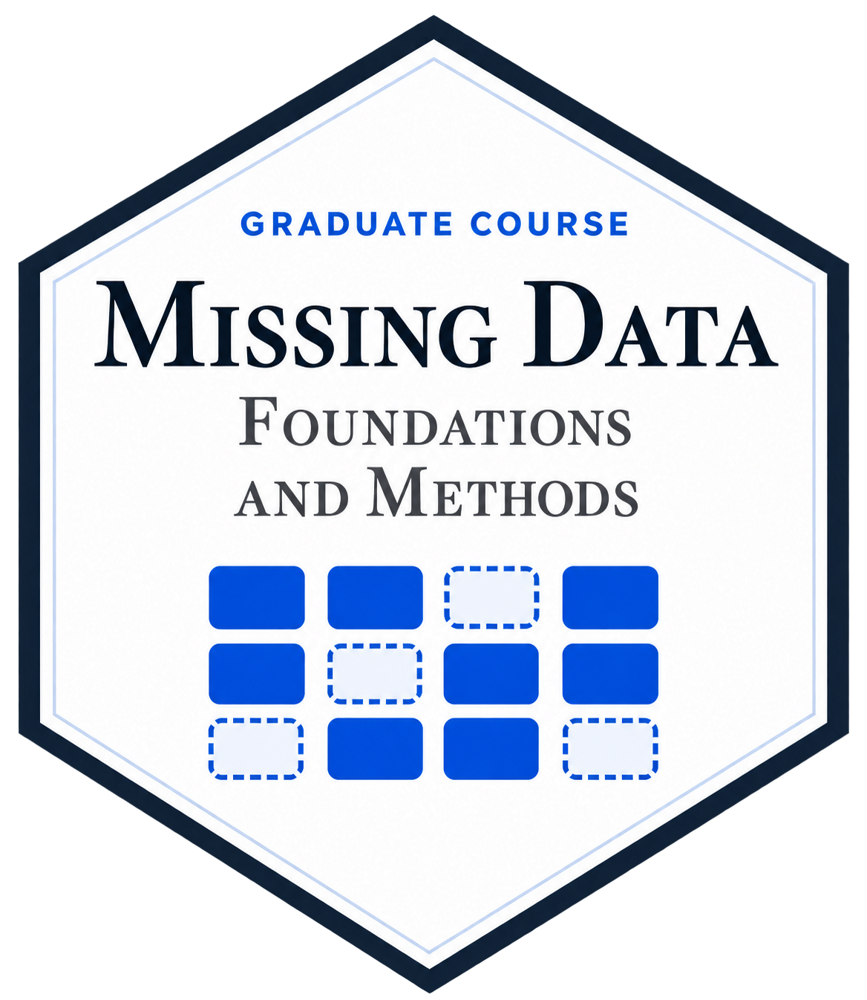

::: {#heading}
School of Medicine and Public Health \| University of Wisconsin-Madison\
WARF Office Building \| 610 Walnut St, Room 207A \| Madison, WI 53726
:::

::::: {.home-layout}
:::: {.home-main}

## Announcements {#annoucements}

-   **September 21, 2026:** The new [WR package website](https://lmaowisc.github.io/WR/) is now live.
    -   Major updates to the WR package on the way.

## Research Interests

Time-to-event data \| causal inference \| clinical trials \| semiparametric theory \| statistical consulting & computing \| diagnostic radiology \| cardiovascular disease \| cancer \| behavioral health interventions

[Request consultation/collaboration](https://ictr.wisc.edu/consults/biostatistics-2)

## Education

-   PhD in Biostatistics (2016) \| The University of North Carolina at Chapel Hill
-   MS in Biostatistics (2010) \| Drexel University
-   BS in Biological Sciences (2005) \| Tsinghua University, China

## Editorial Service

-   Co-Editor \| [*Journal of Biopharmaceutical Statistics*](https://www.tandfonline.com/journals/lbps20/about-this-journal#editorial-board){target="_blank"} \| 04/2026 -- Now
-   Associate Editor \| [*Biometrics*](https://biometrics.biometricsociety.org/home/associate-editors){target="_blank"} \| 07/2026 -- Now
-   Associate Editor \| [*Biometric Bulletin*](https://www.biometricsociety.org/publications/biometric-bulletin){target="_blank"} \| 12/2025 -- Now
-   Associate Editor \| [*Statistics in Biopharmaceutical Research*](https://www.tandfonline.com/journals/usbr20/about-this-journal#editorial-board){target="_blank"} \| 01/2023 -- Now
-   Statistical Editor \| [*JACC Journals*](https://www.jacc.org/journal/heart-failure/editorial-board){target="_blank"} \| 12/2022 -- Now

::::

:::: {.home-highlights role="complementary" aria-label="Teaching highlights"}

## Highlights {#highlights}

```{=html}
<div class="highlight-list">
  <a class="highlight-card" href="https://lmaowisc.github.io/BMI741/" target="_blank" rel="noopener noreferrer">
    
    <span class="highlight-copy"><span class="highlight-kind">University course</span><span class="highlight-title">Applied Survival Analysis</span></span>
  </a>
  <a class="highlight-card" href="https://lmaowisc.github.io/longitudinal-analysis/" target="_blank" rel="noopener noreferrer">
    
    <span class="highlight-copy"><span class="highlight-kind">University course</span><span class="highlight-title">Applied Longitudinal Analysis</span></span>
  </a>
  <a class="highlight-card" href="https://lmaowisc.github.io/missing_data/" target="_blank" rel="noopener noreferrer">
    
    <span class="highlight-copy"><span class="highlight-kind">University course</span><span class="highlight-title">Missing Data: Theory and Methods</span></span>
  </a>
  <a class="highlight-card" href="https://lmaowisc.github.io/tidysurv/" target="_blank" rel="noopener noreferrer">
    
    <span class="highlight-copy"><span class="highlight-kind">R workshop</span><span class="highlight-title">Tidy Survival Analysis</span><span class="highlight-subtitle">Applying R’s Tidyverse to Survival Data</span></span>
  </a>
  <a class="highlight-card" href="https://lmaowisc.github.io/ce/" target="_blank" rel="noopener noreferrer">
    
    <span class="highlight-copy"><span class="highlight-kind">Biostatistics workshop</span><span class="highlight-title">Statistical Methods for Composite Endpoints</span><span class="highlight-subtitle">Win Ratio and Beyond</span></span>
  </a>
</div>
```

[Course and workshop outlines →](courses.qmd){.highlight-more}

::::
:::::

## Recent blog posts

::: {#posts}
:::
