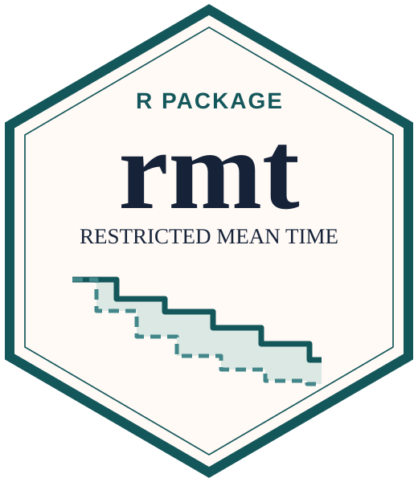

```{=html}
<div class="package-page">
  <p class="package-intro">Statistical software for clinical trials and complex outcomes</p>
  <article class="package-entry" aria-labelledby="wr-title">
    <a class="package-badge-link" href="https://lmaowisc.github.io/WR/" target="_blank" rel="noopener noreferrer" aria-label="Visit the WR package website">
      
    </a>
    <div class="package-copy">
      <h2 id="wr-title"><a href="https://lmaowisc.github.io/WR/" target="_blank" rel="noopener noreferrer">WR</a></h2>
      <p class="package-subtitle">Win ratio methods</p>
      <p class="package-description">Tools for win ratio analysis of prioritized outcomes, including two-sample comparisons, regression, model diagnostics and prediction, sample size calculation, and custom win functions.</p>
      <nav class="package-links" aria-label="WR resources">
        <a href="https://lmaowisc.github.io/WR/" target="_blank" rel="noopener noreferrer">Website</a>
        <a href="https://CRAN.R-project.org/package=WR" target="_blank" rel="noopener noreferrer">CRAN</a>
        <a href="https://github.com/lmaowisc/WR" target="_blank" rel="noopener noreferrer">GitHub</a>
      </nav>
    </div>
  </article>

  <article class="package-entry" aria-labelledby="rmt-title">
    <a class="package-badge-link" href="https://lmaowisc.github.io/rmt/" target="_blank" rel="noopener noreferrer" aria-label="Visit the rmt package website">
      
    </a>
    <div class="package-copy">
      <h2 id="rmt-title"><a href="https://lmaowisc.github.io/rmt/" target="_blank" rel="noopener noreferrer">rmt</a></h2>
      <p class="package-subtitle">Restricted mean time in favor of treatment</p>
      <p class="package-description">Estimation and inference for the net average time gained in a more favorable outcome state over a specified follow-up period, with sample size calculation tools.</p>
      <nav class="package-links" aria-label="rmt resources">
        <a href="https://lmaowisc.github.io/rmt/" target="_blank" rel="noopener noreferrer">Website</a>
        <a href="https://CRAN.R-project.org/package=rmt" target="_blank" rel="noopener noreferrer">CRAN</a>
        <a href="https://github.com/lmaowisc/rmt" target="_blank" rel="noopener noreferrer">GitHub</a>
      </nav>
    </div>
  </article>
</div>
```
