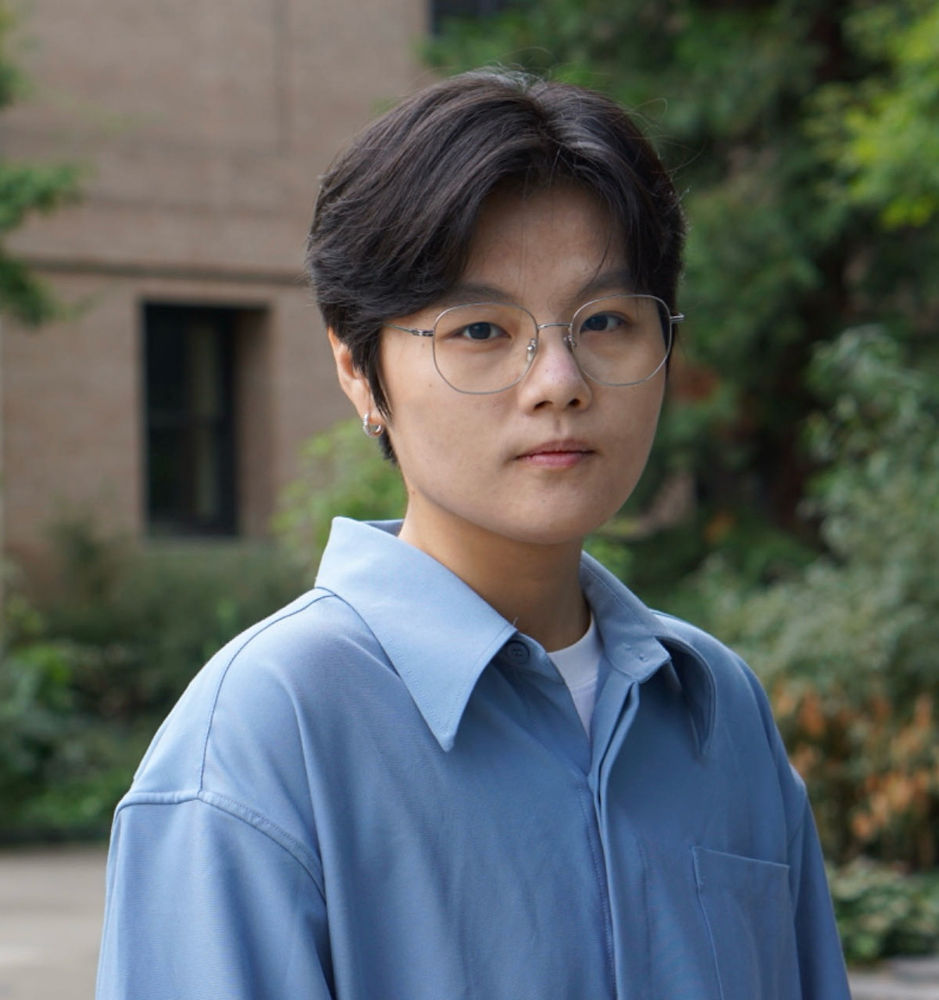

## Current students

:::::: columns
::: {.column width="20%"}
<!-- profile pic -->

{width="100%"}
:::

::: {.column width="5%"}
<!-- empty column to create gap -->
:::

::: {.column width="75%"}
-   Hao Chen, PhD student in Statistics
:::
::::::

:::::: columns
::: {.column width="20%"}
<!-- profile pic -->

{width="100%"}
:::

::: {.column width="5%"}
<!-- empty column to create gap -->
:::

::: {.column width="75%"}
-   Heeyeong Jung, PhD student in Statistics (Biostatistics Option)
:::
::::::

:::::: columns
::: {.column width="20%"}
<!-- profile pic -->

{width="100%"}
:::

::: {.column width="5%"}
<!-- empty column to create gap -->
:::

::: {.column width="75%"}
-   Jenna Pan, PhD student in Biomedical Data Science
:::
::::::

## Alumni

:::::: columns
::: {.column width="15%"}
[Li Ge](https://li-ge.org/){target="_blank"}
:::

::: {.column width="10%"}
<!-- empty column to create gap -->
:::

::: {.column width="70%"}
-   PhD in Biomedical Data Science, UW-Madison, 2024
    -   Dissertation: *Addressing unmeasured confounding in randomized trials or observational studies*
    -   First placement: Senior Scientist - Biostatistics \| Merck \| PA
:::
::::::

:::::: columns
::: {.column width="15%"}
[Tuo Wang](https://tuowang.rbind.io/about/){target="_blank"}
:::

::: {.column width="10%"}
<!-- empty column to create gap -->
:::

::: {.column width="70%"}
-   PhD in Biomedical Data Science, UW-Madison, 2023
    -   Dissertation: *Novel statistical methods for composite endpoints*
    -   First placement: Research Advisor \| Eli Lilly & Company \| Indianapolis, IN
:::
::::::

:::::: columns
::: {.column width="15%"}
Chengning Zhang
:::

::: {.column width="10%"}
<!-- empty column to create gap -->
:::

::: {.column width="70%"}
-   PhD in Statistics (Biostatistics Option), UW-Madison, 2021
    -   Dissertation: *Statistical methods for combining diagnostic tests and performance evaluation metrics*
    -   First placement: Applied Scientist \| Amazon \| Seattle, WA
:::
::::::

:::::: columns
::: {.column width="15%"}
Yi Li
:::

::: {.column width="10%"}
<!-- empty column to create gap -->
:::

::: {.column width="70%"}
-   PhD in Statistics (Biostatistics Option), UW-Madison, 2020
    -   Dissertation: *Variable selection and estimation with censored data*
    -   First placement: Quantitative Associate \| JP Morgan Chase & Company \| Dallas, TX
:::
::::::
