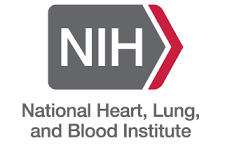
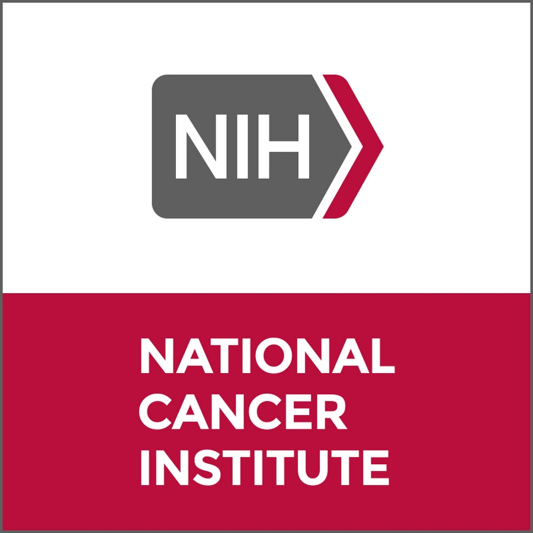

::: {.research-page}

Statistical methods for clinical trials and biomedical research

## Active Funding

:::: {.funding-project}
::: {.funding-agency}
[{.funding-agency-logo .nhlbi-logo fig-alt="NIH National Heart, Lung, and Blood Institute"}](https://www.nhlbi.nih.gov/){target="_blank"}
:::
::: {.funding-copy}
### [Novel Statistical Methods for Complex Time-to-Event Data in Cardiovascular Clinical Trials](https://reporter.nih.gov/search/9aSu5u3xlE26GrjbF_4cBg/project-details/10734551){target="_blank"}

<a href="https://reporter.nih.gov/search/9aSu5u3xlE26GrjbF_4cBg/project-details/10734551" target="_blank" rel="noopener noreferrer">R01HL149875</a> PI 12/2019 – 07/2028 &#36;2,781,980

<ul class="funding-topics"><li>Hierarchical composite endpoints</li><li>Estimand framework</li><li>Group sequential trials</li><li>Semiparametric regression</li><li>Machine learning for survival data</li></ul>
:::
::::

:::: {.funding-project}
::: {.funding-agency}
[{.funding-agency-logo .nci-logo fig-alt="NIH National Cancer Institute"}](https://www.cancer.gov/){target="_blank"}
:::
::: {.funding-copy}
### [HIV/Cervical Cancer Prevention “CASCADE” Clinical Trials Network](https://www.cascade-network.org){target="_blank"}

U24CA275417 UW sub-award PI 07/2022 – 06/2027

UW Clinical Trials Program · <a href="https://dcc.wisc.edu/" target="_blank" rel="noopener noreferrer">Data Coordinating Center</a> · Cervical cancer prevention for women living with HIV

:::
::::

## Past Funding

:::: {.funding-project .past-project}
::: {.funding-agency}
[{.funding-agency-logo .nsf-logo fig-alt="National Science Foundation"}](https://new.nsf.gov/mps/dms){target="_blank"}
:::
::: {.funding-copy}
### [Randomized Trials with Non-Compliance: Extending the Angrist–Imbens–Rubin Framework](https://www.nsf.gov/awardsearch/showAward?AWD_ID=2015526){target="_blank"}

<a href="https://www.nsf.gov/awardsearch/showAward?AWD_ID=2015526" target="_blank" rel="noopener noreferrer">DMS-2015526</a> PI 07/2020 – 06/2024 &#36;186,383

<ul class="funding-topics"><li>Causal inference</li><li>Instrumental variables</li><li>Sensitivity analysis</li><li>Covariate adjustment and semiparametric efficiency</li></ul>
:::
::::

## Collaborative Research

::::: {.collaboration-grid}
:::: {.collaboration-project}
### [UW Radiology](https://radiology.wisc.edu/){target="_blank"}

Lead biostatistical support

- Quantitative imaging biomarkers
- AI-assisted image analysis and interpretation
- Breast imaging
- Preclinical porcine models
::::

:::: {.collaboration-project}
### [UW Carbone Cancer Center](https://cancer.wisc.edu/){target="_blank"}

<a href="https://cancer.wisc.edu/research/resources/bsr/" target="_blank" rel="noopener noreferrer">Biostatistics Shared Resource</a>

- Clinical trials and observational studies
- Animal experiments
- Basic science research
- Meta-analysis
::::
:::::

:::
